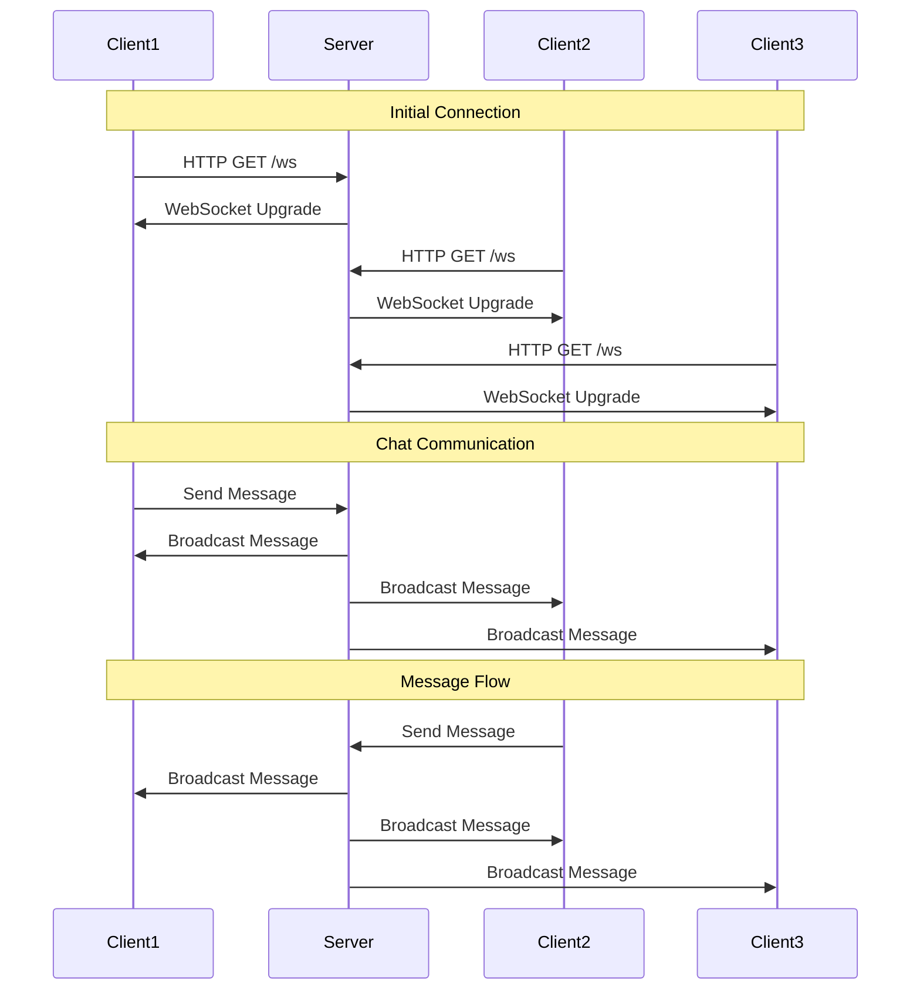

# WebSocket Chat Application

A simple real-time chat application built with Go and WebSockets. This project demonstrates the implementation of a multi-user chat system using WebSocket protocol for real-time communication.

## Table of Contents
- [Overview](#overview)
- [How It Works](#how-it-works)
- [Features](#features)
- [Getting Started](#getting-started)
- [Technical Details](#technical-details)

## Overview

This chat application was built to learn how push works using WebSockets. It allows multiple users to communicate in real-time using WebSocket connections. Each user is automatically assigned a unique identifier based on their connection port, and messages are broadcast to all connected clients instantly.

## How It Works



## Getting Started

### Prerequisites
- Go 1.16 or higher
- Modern web browser

### Installation

1. Clone the repository:
```bash
git clone https://github.com/prajwalbharadwajbm/Backend-Engineering.git
cd Backend-Engineering
cd Push Using WebSockets
```

2. Install dependencies:
```bash
go get github.com/gorilla/websocket
```

3. Run the server:
```bash
go run main.go
```

4. Open your browser and navigate to:
http://localhost:8080 
### Testing
1. Open multiple browser windows
2. Navigate to `http://localhost:8080` in each window
3. Start chatting between windows

## Technical Details

### Server Components

1. **WebSocket Upgrader**
   - Handles HTTP to WebSocket protocol upgrade managing HTTP handshake
   - Manages connection parameters

2. **Client Management**
   - Maintains active client connections
   - Handles client disconnection
   - Manages client identification

3. **Message Broadcasting**
   - Processes incoming messages
   - Broadcasts messages to all connected clients
   - Handles message formatting

### Client Components

1. **WebSocket Connection**
   - Establishes WebSocket connection
   - Handles connection events
   - Manages reconnection

2. **Message Handling**
   - Processes incoming messages
   - Displays messages in chat interface
   - Handles message sending

3. **User Interface**
   - Modern, responsive design
   - Real-time message display
   - Connection status indicators

## Contributing

Feel free to submit issues and enhancement requests!

## License

This project is licensed under the MIT License - see the LICENSE file for details.
