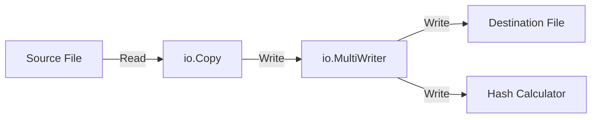
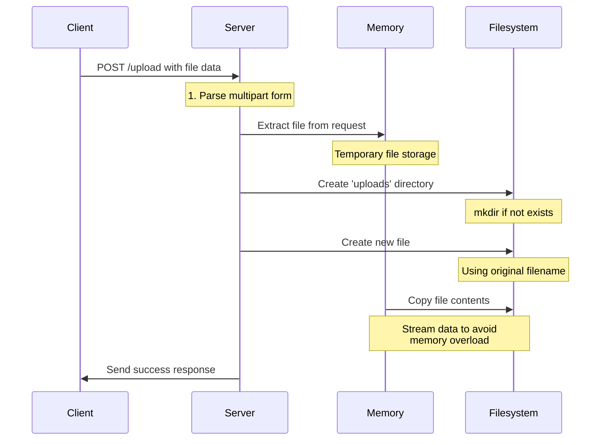

# File Upload Service in Go

This service demonstrates two approaches to handle file uploads:
1. Single Request Upload\wholeFile Request at Once
2. Chunked Resumable Upload

## Architecture Overview

### Single Request Upload
- Simple HTTP POST request with multipart/form-data
- Suitable for smaller files
- No resume capability
- Memory efficient as it streams to disk

### Chunked Resumable Upload
- Splits large files into smaller chunks
- Supports pause/resume functionality
- Better for large files and unstable connections
- Maintains upload state

## API Endpoints

### Single Request Upload
```http
POST /api/v1/upload
Content-Type: multipart/form-data
```
The content type multipart/form-data is used to send a combination of text and file data in a single HTTP request.

> **Note:** Multipart/form-data can be a vector for attacks if not handled properly. Some examples of attacks include:
> - Sending overly large files
> - Sending files that contain malicious code 

### Chunked Upload
```http
POST /api/v1/upload/init
Content-Type: application/json
```

Initializes upload and returns upload ID
```http
POST /api/v1/upload/chunk/{uploadId}
Content-Type: multipart/form-data
```

Uploads individual chunks
```http
GET /api/v1/upload/status/{uploadId}
```
Gets upload status

## Implementation

The implementation consists of the following components:
1. `main.go` - Server setup and route handlers
2. `upload/single.go` - Single request upload handler
3. `upload/chunked.go` - Chunked upload handler
4. `models/upload.go` - Data structures for upload management

## Implementation Details

### Single Upload Flow
The single upload implementation uses an efficient streaming approach with concurrent hash calculation.



### Complete Request-Response Flow
This diagram shows the complete flow of a file upload request from client to server.



The implementation ensures:
- Memory efficiency through streaming
- Data integrity verification via checksums
- Concurrent file writing and hash calculation
- Proper error handling and validation

## Usage Examples

### Single Request Upload
```bash
curl -X POST \
http://localhost:8080/api/v1/upload \
-F "file=@/path/to/image.jpg"
```

### Chunked Upload
1. Initialize upload:
```bash
curl -X POST \
http://localhost:8080/api/v1/upload/init \
-H "Content-Type: application/json" \
-d '{"filename":"image.jpg", "fileSize":1024000}'
```

2. Upload chunks:
```bash
curl -X POST \
http://localhost:8080/api/v1/upload/chunk/{uploadId} \
-F "chunk=@/path/to/chunk" \
-F "chunkNumber=1"
```
## Setup and Running

1. Clone the repository
2. Install dependencies:
```bash
go mod init fileupload
go mod tidy
```
3. Run the server:
```bash
go run main.go
```

The server will start on `localhost:8080`