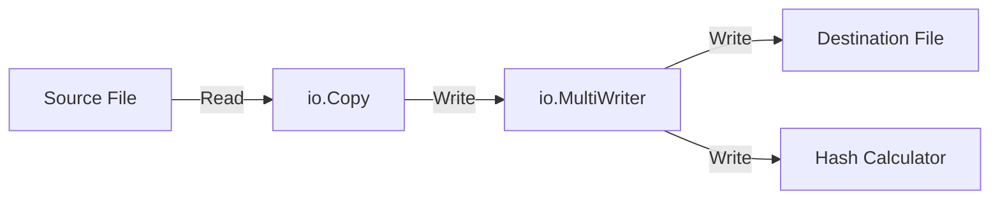
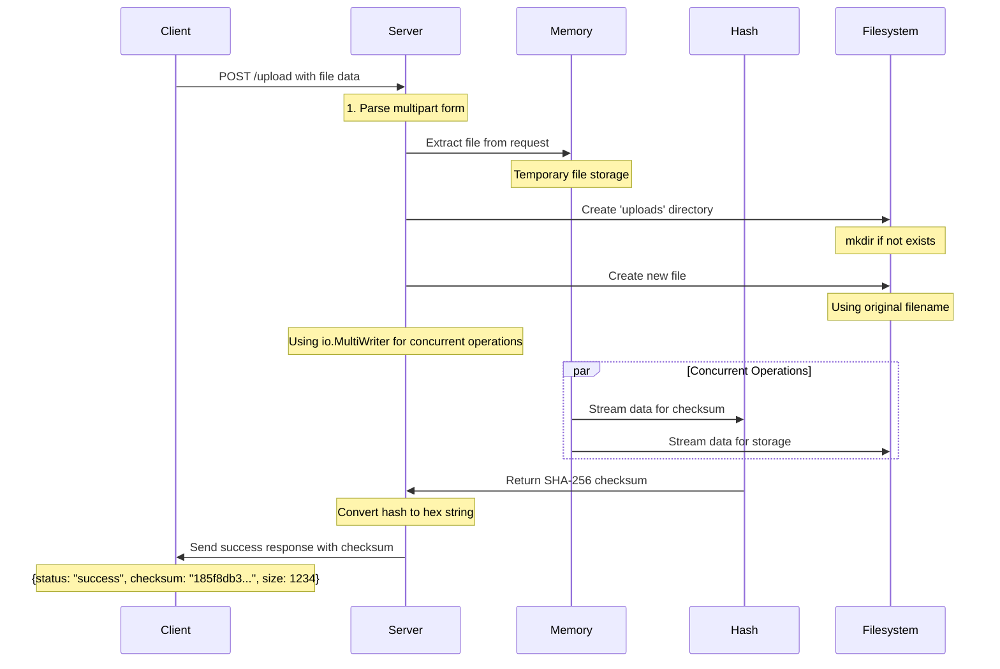
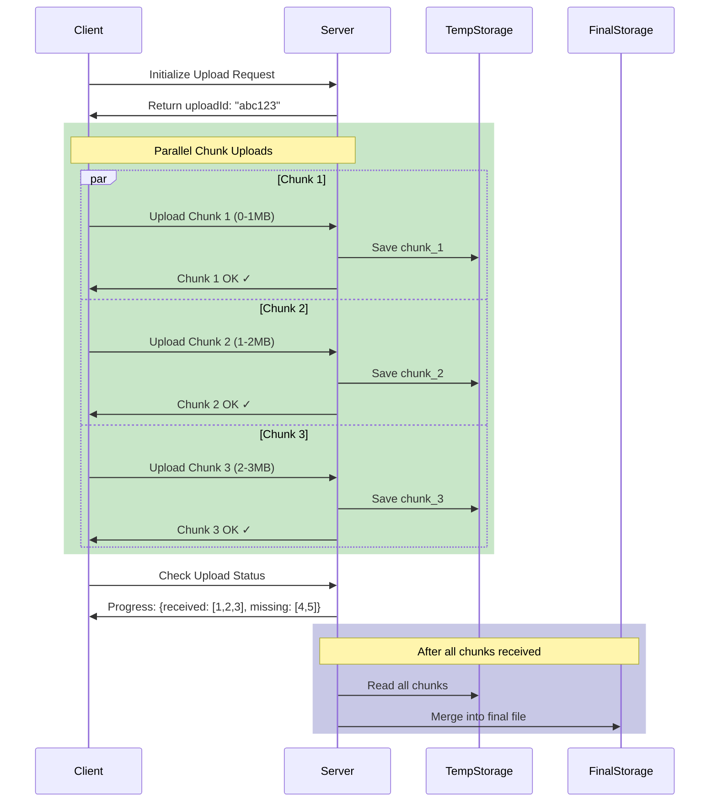
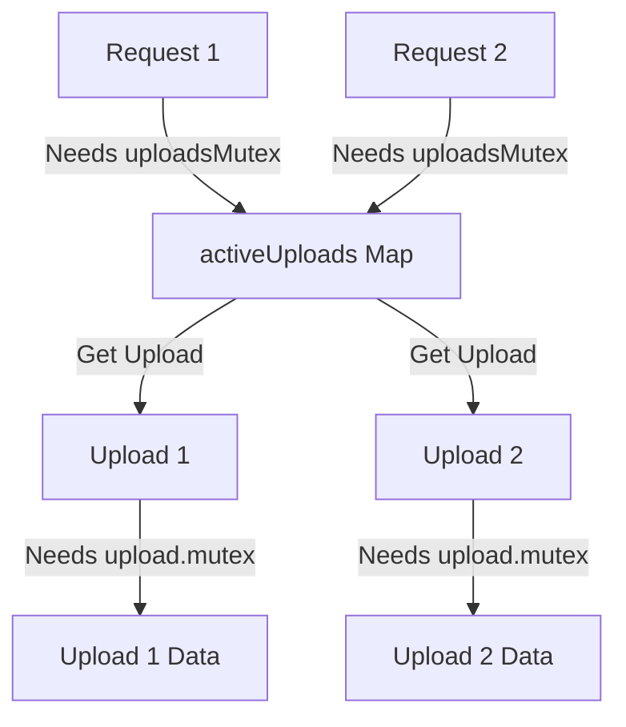

# File Upload Service in Go

This service demonstrates two approaches to handle file uploads:
1. Single Request Upload\wholeFile Request at Once
2. Chunked Resumable Upload: With Multiple Uploads

## Architecture Overview

### Single Request Upload
- Simple HTTP POST request with multipart/form-data
- Suitable for smaller files
- No resume capability
- Memory efficient as it streams to disk

### Chunked Resumable Upload
- Splits large files into smaller chunks
- Supports pause/resume functionality
- Better for large files and unstable connections
- Maintains upload state

## API Endpoints

### Single Request Upload
```http
POST /api/v1/upload
Content-Type: multipart/form-data
```
The content type multipart/form-data is used to send a combination of text and file data in a single HTTP request.

> **Note:** Multipart/form-data can be a vector for attacks if not handled properly. Some examples of attacks include:
> - Sending overly large files
> - Sending files that contain malicious code 

### Chunked Upload
```http
POST /api/v1/upload/init
Content-Type: application/json
```

Initializes upload and returns upload ID
```http
POST /api/v1/upload/chunk/{uploadId}
Content-Type: multipart/form-data
```

Uploads individual chunks
```http
GET /api/v1/upload/status/{uploadId}
```
Gets upload status

## Implementation

The implementation consists of the following components:
1. `main.go` - Server setup and route handlers
2. `upload/single.go` - Single request upload handler
3. `upload/chunked.go` - Chunked upload handler
4. `models/upload.go` - Data structures for upload management

## Implementation Details

### Single Upload Flow
The single upload implementation uses an efficient streaming approach with concurrent hash calculation.



### Complete Request-Response Flow
This diagram shows the complete flow of a file upload request from client to server.

#### Whole File Upload Flow


#### Chunked File Upload Flow
First, I thought of working with sequntial flow, but then i considered to go with parall chunk uploads, which makes the process faster and efficient.



### Mutex Architecture
The implementation uses two levels of mutex locks for thread-safe operations:



1. **Global uploadsMutex**: Protects the shared map of all active uploads
2. **Per-Upload mutex**: Protects individual upload data

This two-level locking system allows:
- Multiple uploads to proceed in parallel
- Thread-safe operations on both global and individual upload data
- Better performance through finer-grained locking

## API Endpoints

### Chunked Upload
```bash
# Initialize upload
POST /api/v1/upload/init
Content-Type: application/json

# Upload chunk
POST /api/v1/upload/chunk/{uploadId}?chunkNum={number}
Content-Type: multipart/form-data

# Check status
GET /api/v1/upload/status?uploadId={uploadId}
```

### Single File Upload
```bash
POST /api/v1/upload
Content-Type: multipart/form-data
```

## Setup and Running

1. Clone the repository
2. Install dependencies:
```bash
go mod init fileupload
go mod tidy
```
3. Run the server:
```bash
go run main.go
```
4. Access the application

## Learning Outcomes

### Technical Skills Gained
1. **Concurrent Programming in Go**
   - Mutex implementation
   - Goroutine management
   - Thread-safe operations

2. **File Handling**
   - Chunked file operations
   - Efficient memory usage
   - Cleanup procedures

3. **Modern Web Development**
   - Real-time progress updates
   - Concurrent uploads
   - Error handling


### Challenges Overcome
1. Race conditions in concurrent uploads
2. Memory management with large files
3. Proper cleanup of temporary files
4. UI/UX for multiple file uploads

## Future Improvements
- [ ] Drag and drop support
- [ ] Upload queue management
- [ ] Pause/Resume functionality
- [ ] Bandwidth throttling
- [ ] Upload speed analytics
- [ ] Merge parallely in background for chunked upload 

## Contributing
Feel free to submit issues and enhancement requests!
