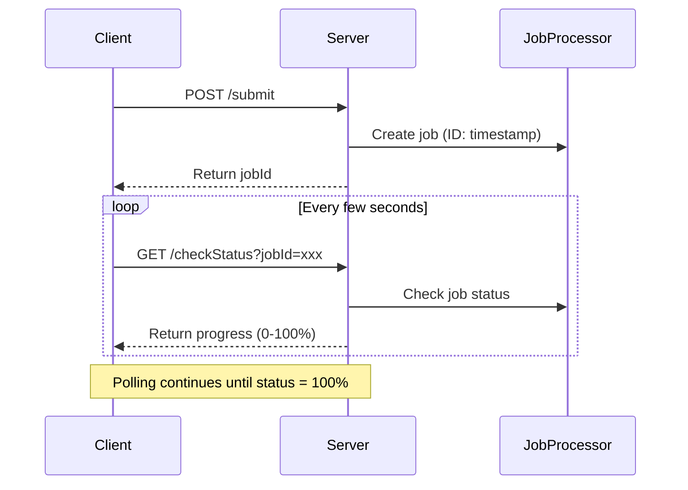

# Short Polling Demo Project

This is a learning project demonstrating how short polling works in web applications. The project implements a simple job processing system where clients can submit jobs and manually poll for their status.

## Overview

Short polling is a technique where a client repeatedly requests information from a server at regular intervals. While Short Polling is not effective for real-time updates, it's a simple way to implement real-time updates.

## How It Works

## Features
- Job submission endpoint (`/submit`)
- Status checking endpoint (`/checkStatus`)
- Background job processing (simulated with increments of 10% updates every 3 seconds)

## Limitations of Short Polling
- Increased server load due to frequent requests
- Higher latency compared to WebSocket
- More bandwidth usage on the server side, which could have been used for actually serving the content
- Not suitable for real-time applications requiring immediate updates, and thats the reason why kafka uses long polling.

